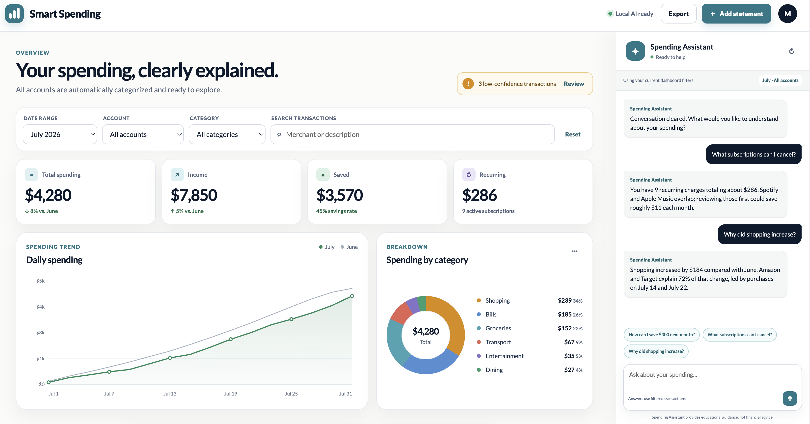

# Smart Spending

Smart Spending is a privacy-first financial tracker that turns uploaded bank
and credit-card statements into automatically categorized transactions,
spending analytics, and conversational guidance.

I’m building this project as part of ByteByteGo’s [Become an AI Engineer | Learn by Doing](https://blog.bytebytego.com/p/become-an-ai-engineer-learn-by-doing) cohort-based course.

## Prototype

[Open the interactive HTML mockup](./prototype/index.html)

The prototype is a single-page dashboard with:

- Global date, account, category, and merchant filters
- Spending, income, savings, and recurring-expense metrics
- Trend and category charts
- Automated spending analysis
- A filterable transactions table
- A persistent Spending Assistant

## Product specification

See [PRODUCT_SPEC.md](./PRODUCT_SPEC.md) for the complete product, design,
privacy, AI, ingestion, data-model, API, testing, and delivery specification.
